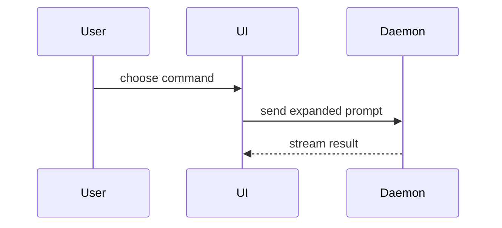

# Show me

Explain the current topic of conversation visually. Skip the preamble
and keep prose brief. Pick the smallest view that makes the key point
clear.

## Harness Context (Stratified Disclosure)

The house palette, the artifact location, and the open command are
supplied by the invoking harness. The palette in HTML is the CrossR
disclosure example; other harnesses substitute their own. Place the
file next to the work or under the harness's plan directory. Open it
with whatever preview the environment provides.

## When

- Pull request: shape-diff of the call tree, file tree, or component
  tree; sequence of the changed path. Show what moved, not the whole
  system. Do not restate the GitHub diff.
- Plan: proposed file tree, intended call tree, types or signatures,
  short pseudocode of the new path.
- Architecture plan: layer or sequence Mermaid, responsibility file
  tree, module-boundary component tree.
- Anything else: the one form that answers the current question.

You may use one of these, you may use several. It is unlikely you
will use all of them.

## Forms

Logic or an algorithm as pseudocode:

```text
on(save)
  if content is unchanged
    return cached result
  write new content
  return fresh result
```

Runtime control flow as a call tree:

```text
submitForm
  createSession
    persistPrompt
    launchAgent
  navigateToSession
```

UI structure as a component tree, including state and module
boundaries that matter:

```tsx
<SessionPage> (apps/example/src/routes/session.tsx)
  useSessionEvents()
  <SessionToolbar>
    <RunSkillButton> (packages/ui)
```

File responsibility or a broad refactor as a shallow file tree:

```text
src/
├── commands/       # parses user actions
├── sessions/       # owns session state
└── transport/      # sends API requests
```

Component interaction, control flow, or data flow with Mermaid:



Use `diff` when the point is what changes and the surrounding shape
already exists. Match the diff shape to the topic.

For a component change:

```diff
 <SessionPage>
   useSessionEvents()
   <SessionToolbar>
+    <RunSkillButton />
   <SessionTimeline>
+    <SkillResultCard />
```

For a file-layout change:

```diff
 src/
 ├── commands/
+│   └── show-me.ts       # expands the slash command
 ├── sessions/
-└── transport.ts
+└── transport/
+    ├── client.ts
+    └── stream.ts
```

For a call-tree or call-stack change:

```diff
 submitForm
   createSession
     persistPrompt
+    expandSkillMention
     launchAgent
   navigateToSession
+    subscribeToEvents
```

For a state or control-flow change:

```diff
 on(save)
-  write content
+  if content is unchanged
+    return cached result
+  write new content
+  invalidate cache
```

Show the whole block when most of it is new, when omitted context
would hide ownership or order, or when the user needs a copyable
target shape:

```ts
function expandSkill(command: string): string {
  const skillName = command.slice(1)
  return `use the ${skillName} skill`
}
```

## HTML

For a visual UI, layout, state comparison, or concept too dense for
Mermaid, write one focused, self-contained HTML file (inline styles
or a CDN stylesheet, no local assets) — a diagram, an infographic, or
a short slide deck. Match the product's colors, type, spacing, and
components. Use real labels and data. Support desktop and mobile.
A full explainer page (playable flow, architecture drawing,
screenshot QA) is `html-explainer`.

House palette when the artifact is for Sycamore / CrossR:

- Well pitch `#171412`
- Plaster page `#F3EEE6`
- Packed mile `#C4A882`
- Split fig `#9E4E36`
- Dust leaf `#6A7348`
- Canopy shade `#2E342C`

Write the file next to the work (`show-me-<slug>.html` or under
`docs/plans/`).

## Guidance

Place each visual next to the short text it supports. Keep only the
calls, files, props, states, and boundaries needed to answer the
current question.

If the visual is larger than the point, drop to a smaller form.
If the HTML file cannot be opened, the text, tree, or Mermaid
form stands.

This skill presents shape. It does not review, bless, reject, or
open a PR.

## Verification

In a fresh activation the following six behaviors are directly
observable and scorable:

- The agent picks one form from When that matches the current
  topic (PR, plan, architecture plan, or other) before writing
  prose, and does not restate a GitHub diff.
- The agent uses the smallest view that makes the point: a
  shape-diff when the surrounding shape exists, the whole block
  only when omitted context would hide ownership or order.
- The agent places each visual next to the short text it
  supports and keeps only the calls, files, props, states, and
  boundaries needed for the current question.
- HTML artifacts are one self-contained file (inline styles or
  a CDN stylesheet, no local assets), written next to the work
  or under the harness plan directory, using the harness palette
  when the artifact is for that harness.
- The agent does not post a GitHub review thread, issue a
  BLESS/REJECT, or open a PR.
- On failure (form too large, preview unavailable) the agent
  drops to a smaller form or lets the text/Mermaid stand.

Violations against any of these observable criteria during
fresh activation indicate the skill was not followed and must
be corrected before the work can be considered complete.

## Specialization

This skill is the visual-explanation specialization of the
writing layer (precondition: a current topic of conversation).
It supplies the form catalog, the smallest-view rule, the
self-contained HTML contract, and the non-goal boundary
against review and verdict skills (postcondition: the output
is a shape next to short prose, never a gate or a PR).

Adapted from HumanLayer show-me. Copyright (c) 2026 HumanLayer.
MIT License — see https://github.com/humanlayer/skills/blob/main/LICENSE
